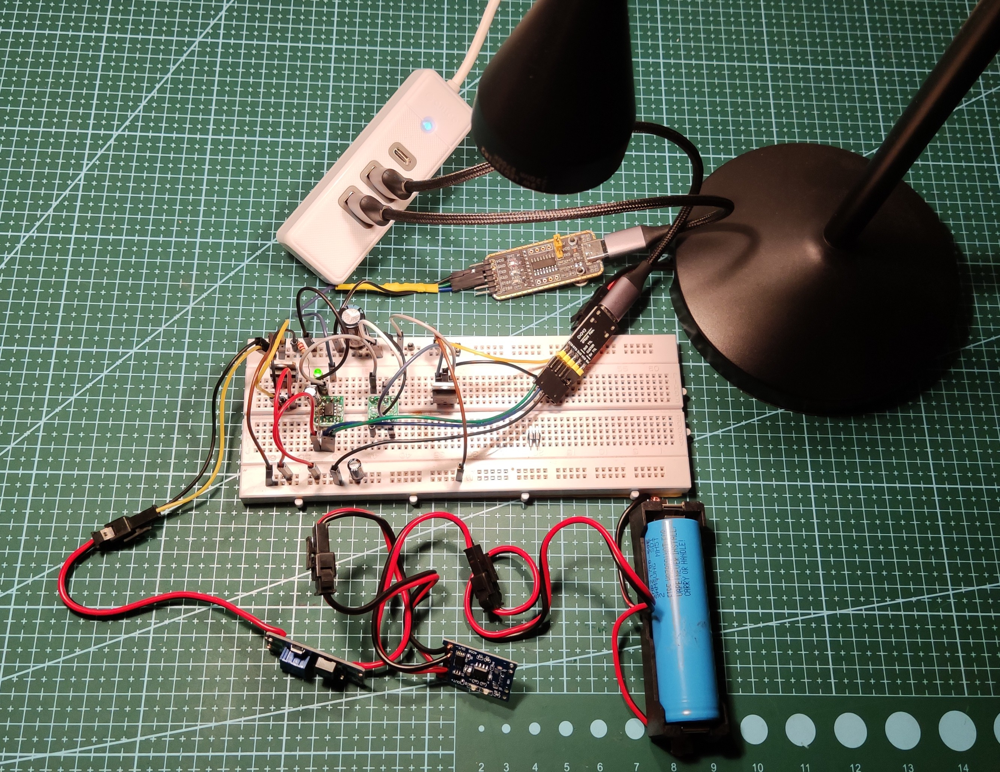

# LampATTiny

## Version 1.0

2024-11-25

### What works:
- Lamp is glowing
- microcontroller can dimm LED
- uart PC - microcontroller works

We can set a brigtness from 0 to 100 using uart.

### What will work in future
- securing cell with BMS
- possibility of charge and discharge cell at the same time
- more linear brightness scale
- wifi (maybe RPI)
- zigbee (maybe espersiff)
