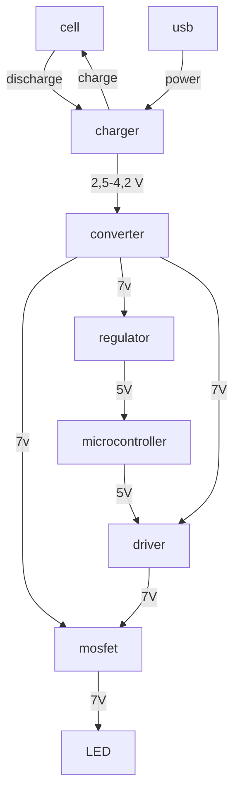
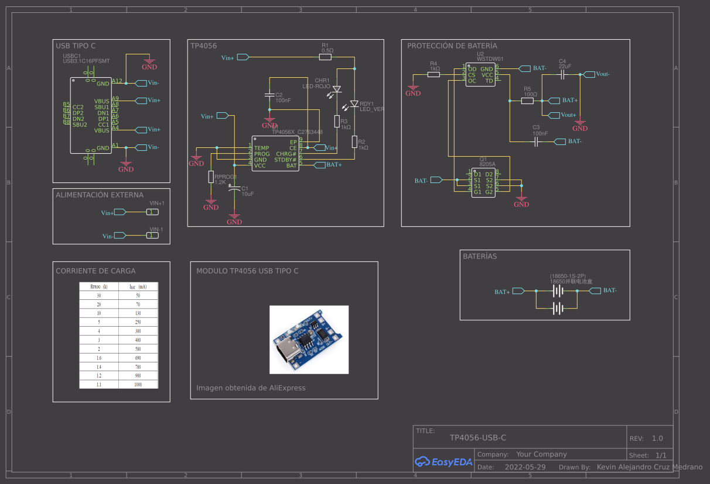
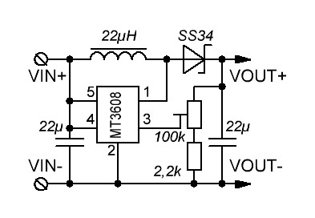

# LampATTiny References

Reference guides are technical descriptions of the machinery and how to operate it. Reference material is information-oriented.

This Reference describe hardware used to power the lamp and other additional parts like microcontrollers.

## Electric

### General

### Power supply

hardware used to power the lamp and other additional parts like microcontrollers.

??? "Cell (Samsung INR21700-50E)"
    #### Cell
    As a main power source Li-ion cell 21700 is used. 
    Samsung INR21700-50E

    - Standard discharge capacity: 4900mAh (0.2C discharge)
    - Rated discharge capacity: 4753mAh (1C discharge)
    - Charge voltage: 4.2V
    - Nominal voltage: 3.6V
    - Charging method: CC-CV
    - Maximum charge current: 4900mA
    - Maximum continuous discharge current: 9800mA
    - Maximum pulse discharge current: 14700mA
    - Discharge cut-off voltage: 2.5V
    - Cycle life: 500 cycles to 3802mAh (80%)
    - Operating temperature: Charge: 0°C ~ 45°C, discharge: -20°C ~ 60°C
    - Storage temperature: 1 month: -20°C ~ 60°C, 3 months: -20°C ~ 45°C, 1 year: -20°C ~ 23°C 

??? "BMS (no bms)"
    #### BMS
    not available at this time, has to be added.

??? "Charger (TP4056)"
    #### Charger

    TP4056 module is used for charging

    Chip: TP4056  
    Supply voltage: (USB type C or IN connectors) 5 V  
    Charging voltage: 4,2 V ± 1%  
    Maximum charging current: 1 A  
    Two indicator lights:

    - Red: charging
    - Blue: Fully charged  

    Protection against discharging below 2.5 V  
    Protected against current draw of more than 3 A  
    Module dimensions 26 x 17 mm  

    

??? "Voltage converter (MT3508)"
    #### Voltege converter
    Module MT3608 is used to boost voltage to 7V

    [documentation from addicore](https://www.addicore.com/products/mt3608-step-up-adjustable-dc-dc-switching-boost-converter)

    This module features the MT3608 2 Amp step up (boost) converter, which can take input voltages as low as 2V and step up the output to as high as 28V. The MT3608 features automatic shifting to pulse frequency modulation mode at light loads. It includes under-voltage lockout, current limiting, and thermal overload protection.

    This module has a multi-turn trimpot (potentiometer) that you can use to adjust the output voltage. Since the trimpot has 25 turns of adjustment you can easily adjust the output of the module to exactly the voltage you need.

    Boost converters are a great way to easily increase a given voltage, but that boost comes at the cost of less output current compared to input current.

    Since this is a boost converter the output voltage has to be higher than the supplied input voltage. 

    - Input Voltage: 2 to 24 V
    - Max Output Voltage: 28 V
    - Max Output Current: 2 A
    - Adjustment: 25-Turn Trimpot
    - Efficiency: up to 93%
    - Switching Frequency: 1.2 MHz

    

### Microcontroller

test

### Power regulator

## Mechanic