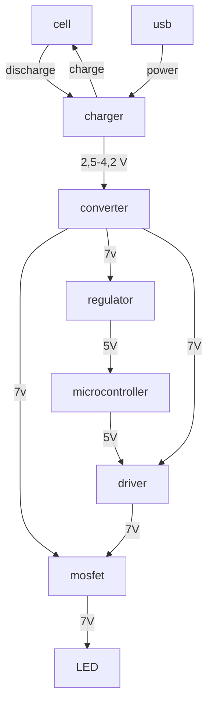

# LampATTiny References

Reference guides are technical descriptions of the machinery and how to operate it. Reference material is information-oriented.

This Reference describe hardware used to power the lamp and other additional parts like microcontrollers.

## Electric

### General

### Power supply

hardware used to power the lamp and other additional parts like microcontrollers.

??? "Cell"
    #### Cell

[//]: # "automate with doccommon: ../docs/Cell_Samsung_INR21700-50E/Cell_INR21700-50E_ref_01.md S4"
    Samsung INR21700-50E - standard Li-Ion cell 21700
    
    - Standard discharge capacity: 4900mAh (0.2C discharge)
    - Rated discharge capacity: 4753mAh (1C discharge)
    - Charge voltage: 4.2V
    - Nominal voltage: 3.6V
    - Charging method: CC-CV
    - Maximum charge current: 4900mA
    - Maximum continuous discharge current: 9800mA
    - Maximum pulse discharge current: 14700mA
    - Discharge cut-off voltage: 2.5V
    - Cycle life: 500 cycles to 3802mAh (80%)
    - Operating temperature: Charge: 0°C ~ 45°C, discharge: -20°C ~ 60°C
    - Storage temperature: 1 month: -20°C ~ 60°C, 3 months: -20°C ~ 45°C, 1 year: -20°C ~ 23°C
[//]: # "automate with doccommon: ../docs/Cell_Samsung_INR21700-50E/Cell_INR21700-50E_ref_01.md S4"

??? "BMS"
    #### BMS

[//]: # "automate with doccommon: ../docs/BMS_STJF/bms_stjf_ref_01.md S4"
    Some cheap China BMS PCM battery protection board
    
    - brand: STJF
    - MOS transistor can control the battery charge and discharge
    - Over charge voltage: 4.25 +/- 0.05V
    - Over charge release oltage 4.23 +/- 0.05V
    - Over discharge voltage 2.54 +/- 0.1V
    - Maximal continuous charging current: 2A
    - Maximal coninous dischagrging current: 2A
    - Overcurrent protection 3A
    - Size: L4xW4xT3mm
    - Weight: 10g
[//]: # "automate with doccommon: ../docs/BMS_STJF/bms_stjf_ref_01.md"

??? "Charger"
    #### Charger

[//]: # "automate with doccommon: ../docs/Battery_controller_MCP73871/bc_MCP73871_ref_01.md S4"
    Some China Battery Charge Management Controller based on MCP73871 chip
    
    - 3.7V/4.2V Lithium Ion or Lithium Polymer battery chargernt
    - Charge with 5-6V DC, USB or 6V solar panel!
    - Too dark out?Use a USB mini-B cable or a 5V DC adapter
    - Automatic charging current tracking for high efficiency use of any wattage solar panel
    - Use any 6V solar panel
    - Three color indicator LEDs- Power good, Charging and Donent
    - Low Battery Indicator(fixed at 3.1V) with LED output
    - Set for 500mA max charge rate, can be adjusted from 50mA up to 1A by soldering in a resistor
    - Will always draw the most current possible from a solar cell- up to the max charge rate!
    - Smart load sharing automatically uses the input power when available, to keep battery from constantly charging/discharging
    - Temperature monitoringof battery by soldering in a 10K NTC thermistor (not included) - suggested for outdoor projects where the battery may get hot (50u00b0C) or cold (0u00b0C).
[//]: # "automate with doccommon: ../docs/Battery_controller_MCP73871/bc_MCP73871_ref_01.md S4"

??? "Voltage converter"
    #### Voltage converter

[//]: # "automate with doccommon: ../docs/Voltage_converter_MT3508/vc_MT3508_ref_01.md S4"
    Module MT3608 is used to boost voltage
    
    [documentation from addicore](https://www.addicore.com/products/mt3608-step-up-adjustable-dc-dc-switching-boost-converter)
    
    This module features the MT3608 2 Amp step up (boost) converter, which can take input voltages as low as 2V and step up the output to as high as 28V. The MT3608 features automatic shifting to pulse frequency modulation mode at light loads. It includes under-voltage lockout, current limiting, and thermal overload protection.
    
     This module has a multi-turn trimpot (potentiometer) that you can use to adjust the output voltage. Since the trimpot has 25 turns of adjustment you can easily adjust the output of the module to exactly the voltage you need.
    
    Boost converters are a great way to easily increase a given voltage, but that boost comes at the cost of less output current compared to input current.
    
    Since this is a boost converter the output voltage has to be higher than the supplied input voltage. 
    
    - Input Voltage: 2 to 24 V
    - Max Output Voltage: 28 V
    - Max Output Current: 2 A
    - Adjustment: 25-Turn Trimpot
    - Efficiency: up to 93%
    - Switching Frequency: 1.2 MHz
    
    
[//]: # "automate with doccommon: ../docs/Voltage_converter_MT3508/vc_MT3508_ref_01.md S4"

### Microcontroller

test

### Power regulator

## Mechanic